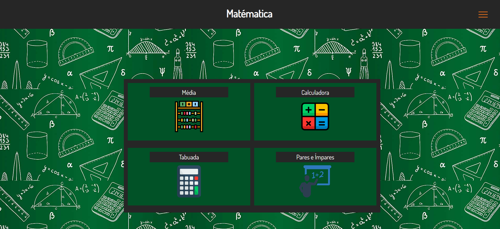

# Site Matématica
Site sobre mátematica e quatro funcionalidades, média, calculadora, tabuada e pares e ímpares. Com fins didáticos, para o curso de desenvolvimento de sistemas do [SENAI Jandira](https://jandira.sp.senai.br/), sobre orientação do professor [Marcel].

## Objetivo do exercício

Realizar o desenvolvimento da ativiidade utilizando function em php e confeccionar uma página onde se tem as quatro funcionalidades.

## Website

A galeria pode ser acessada pelo link: [vitoraguiarc](https://github.com/vitoraguiarc/atividade-01)

## Tecnológias

- HTML5
- CSS3
- VSCODE
- PHP
- JavaScript

## Screenshot

